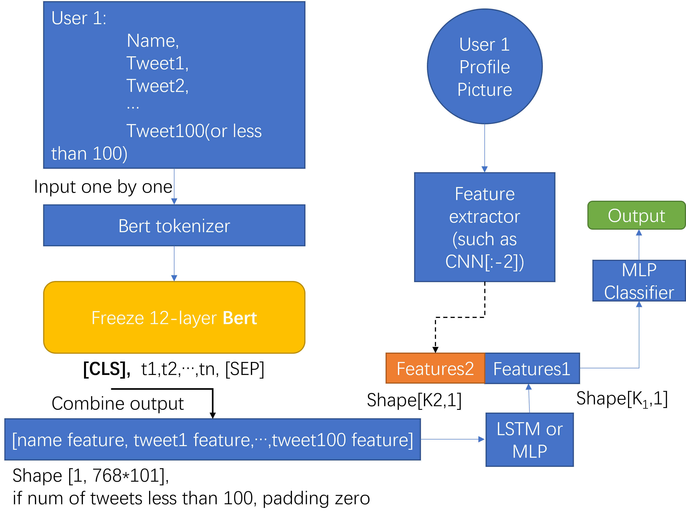

# CS640_Project
## Disclaimer
All cleaned and raw data has been removed upon making this repo public since they are proprietary. 

## Goal
Demographic (Age (<21 and >=21) and Race (black, white, Hispanic/Latino, Asian) prediction of Twitter users
## Existing Data
Twitter user profile and it's most recent 100 tweets
## Process
1. Text Processing
2. Train CNN model on UTK face
3. Race prediction: 
(1) CNN 
(2) TF-IDF Logistic Regression 
(3) BERT 
4. Age prediction: 
(1) TF-IDF Logistic Regression 
(2) TF-IDF Multinomial Naive bayes 
(3) BERT 
(4) BERT-LSTM-FC 
## Models
Models directory contains all final models tried in their own folders.
### Race Prediction-Tf-idf Vectorizer Logistic Regression
We were motivated to try this approach as a baseline because the project description did provide an attempted approach of Tf-idf logistic regression. 
#### Model description:
The model vectorizes each tweet as a document and only keeps features that have a minimum data frequency of 4 to reduce overfitting. Feature space around 10k. 

The data distribution over users groupby race is {Black: 374, Hispanic: 241, Asian: 140, White: 3184}, which is heavily imbalanced towards White. We trained a mode with undersampling and one without over 5 fold to see the precision recall scores. 
### Race Prediction-BERT
We choose Bert because it’s already pre-trained on a lot of text and we are expecting Bert to be able to extract some feature that is related to user race.
#### Model Description:
The model is BertForSequenceClassification.from_pretrained("bert-based-uncased"), we set the parameters of the model with num_labels = 4, output_attentions = False, output_hidden_states = False.

We performed hyperparameter tuning by using the Ray Tune package, and the hyperparameters we tuned are batch size and learning rate.

### Race Prediction-Face detection and CNN classification model
This method is motivating because we believe that there is too much noise and not enough sample in the Twitter user profile picture dataset, so we decided to firstly train the CNN model on the UTK dataset, which is much larger and has less noise on the pictures.

#### Remove non-human profile pictures:
Before we start training the CNN model, used RetinaFace(https://arxiv.org/abs/1905.00641)
to remove pictures that contains no human face. This will help reduce the noise when using the CNN model for predictions.

#### Model Description:
The model used 3x3 Conv2D layers and 3x3 MaxPooling2D layers to extract image features. Then use a deeply connected Dense layer to produce outputs. We used ReLU as the activation function of the network, and softmax for the output layer. Each fold will perform 200 epochs of training. The initial learning rate is 1e-4. The optimizer is Adam.

### Age Prediction-TFIDF Vectorizer + Logistic Regression
We chose this method because TF-IDF can turn text into vector features, and logistic regression can identify the relationship between word frequencies and race.

#### Model Description:
Use TfidfVectorizer with min_df=4 then use LogisticRegression from sklearn to train model. Feature space around 10k. 

### Per tweet and per user

We set 2 modes to feed the inputs into the models, 
the first is using per tweet as an input, 
the second is merging all tweets per user to one tweet. 

### Age Prediction-TFIDF Vectorizer + Multinomial Naive Bayes
We chose this method because TFIDF can turn text into vector features, and logistic regression can identify the relationship between word frequencies and race. 

#### Model Description:
We use TfidfVectorizer(max_features=max_features, ngram_range=ngram_range) to vectorize the input texts.
For per tweet inputs, we set max_features={1000, 2000, 5000, 8000} and ngram_range={(1,1),(2,2),(3,3),(4,4)}.
For per user inputs, we set max_features={1000, 2000, 5000, 8000} and ngram_range={(1,1),(2,2),(3,3),(4,4)}.

Then we use Multinomial Naive Bayes (MultinomialNB()) to train and test the model

### Age Prediction-Fine Tuned Bert
We choose Bert because it’s already pre-trained on a lot of text and we are expecting Bert to be able to extract some feature that is related to user age.

#### Model Description:
We implement BertForSequenceClassification.from_pretrained("bert-based-uncased") to get the classification results, and we set the parameters of the model with num_labels = 2, output_attentions = False, output_hidden_states = False.

### Age Prediction-Bert + LSTM +FC
We chose this model because we expect the Bert can extract some useful features, and LSTM will be able to learn based on those features with consideration of the order of the text.

#### Model Description:
Since we found that 12-layer bert is easily to be overfitting, so we just use bert as a embedding features extractor, it will not be trained. And also, the max input length of bert is 512, if we want to combine all tweets of per user as one input, only the first 512 words will be considered. We was supposed to get the features of all tweets per user, then concatenate them into one tensor, shape[1,768*100], as one input,  We also want to combine the features extract from a cnn model of the profile picture

## Conclusion
We tried 2 models for race predictions and 4 models for age prediction that uses the tweet text. An overall trend is that the per tweet approaches will yield a better recall and using per user results in better precision but the overall F1 score remains approximately 0.64 across the board. We believe this is the limitation of using tweets for classification, that without any extra meta data analysis or advanced feature extraction models will be limited to 0.64 in F1 score no matter the approach. Within the models we tried, models powered by BERT are reliably better or the same in f1 score as other approaches which is not surprising because the corpus of tweets had over half the words having only occurred 4 times or less. But it is not significantly better due to typos, emojis, and foreign language used in some tweets. 

For models that we used profile pictures, the race prediction works well on UTK dataset but performed poorly on the Twitter user profile picture dataset. This is because the profile pictures has too much noise. Some of them are not actual user face, some of them used a filter, some of them are taken from a weird direction. We’ve tried to remove those noise, but the result is still not satisfying.

## Todo:
Use BertTokenizer and frozen BertModel to get the features of every tweet,
and concatenate them by the usernames, 
then feed them into the LSTM+FC network, 
so that we can get the full information of all tweets. 
Then, combine them with the features extracted from a feature extractor(such as CNN model) of the profile picture to train a classifier.

